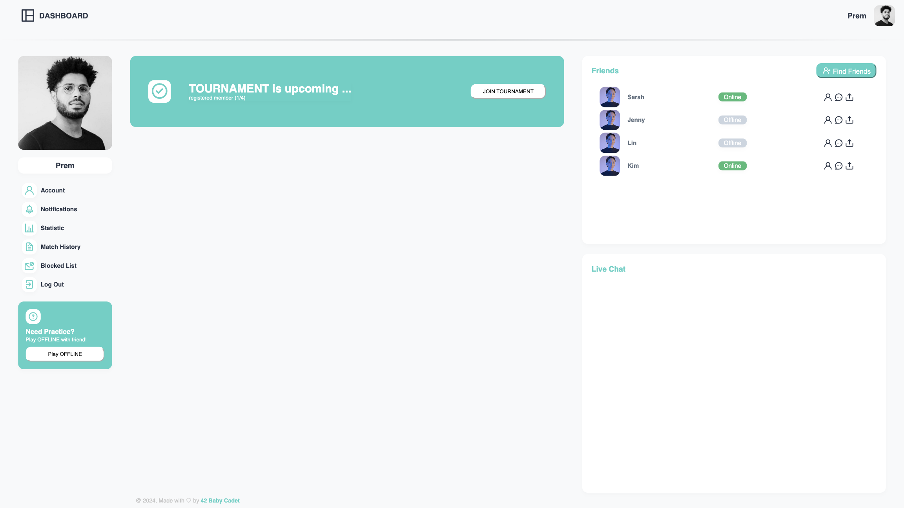

# Transcendence-Fontend (DOM style)

## Icon

- [Unicons Getting Started](https://iconscout.com/unicons/getting-started/line)
- [Where to get icons - Line Icon](https://iconscout.com/unicons/free-line-icon-fonts)

## Font

- Font type
[Poppins on Google Fonts](https://fonts.google.com/specimen/Poppins?query=pop)

- Font color -Default ** NOT BLACK **
```css
color: #2D3748;
```
- Font Size - Header
```css
font-size: 0.9rem;
```
- Font Size - Default
```css
font-size: 0.8rem;
```

## Styles
- Button (Sample)
```css
#offline-pong .btn {
	margin-top: 0rem;
	width: 100%;
	height: 2rem;
	text-align: center;
	border-radius: 0.75rem;
	padding: 1rem 1;
	background-color: white;
	border-color: white;
	font-size: 0.7rem;
}
```
- Box-shadow
```css
box-shadow: 0 4px 8px rgba(0, 0, 0, 0.02); 
```
- Border-radiue
```css
border-radius: 0.75rem;
```

## Colors

- Font (Default) - dark blue
```css
color: #2D3748;
```
- Background (Default) - light gray
```css
background-color: #F8F9FA;
```
- Background (Text-box) - white
```css
color: white;
```
- Background (Non-active) - darker-gray
```css
background-color: #C4C4C4;
```
- Theme - green
```css
color: #4FD1C5;
```

## Preview




